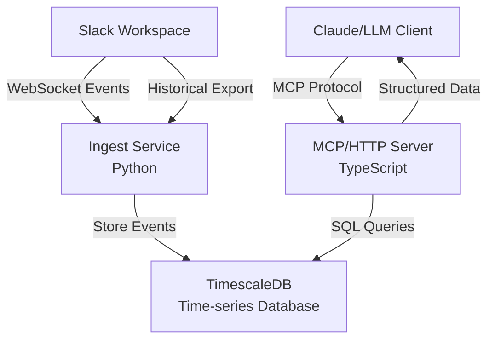

# Tiger Slack

**Conversational Memory for AI Slack Bots**

Tiger Slack gives Slack-native AI assistants the ability to understand and engage with your team's conversations naturally. By providing real-time access to Slack message history and context through an MCP server, it enables AI bots to respond to questions with the same contextual awareness that humans have - understanding references to past discussions, ongoing projects, and team dynamics.

Tiger Slack is the superpower behind [Eon](https://github.com/timescale/tiger-eon), TigerData's Slack-native AI assistant.

Ready to get started? Jump to the [quick start](#quick-start).

## Overview

Built for teams who want their AI assistants to:
- **Understand conversational context** and references to past discussions
- **Answer questions about project history** and decisions
- **Know who's involved** in different topics and threads
- **Follow ongoing conversations** and provide relevant input
- **Build conversational memory** across all team channels

## Key Components

### **Ingest Service** (`ingest/`)

The ingest service is a Python app that:
- Connects to Slack via WebSocket (Socket Mode)
- Captures messages, reactions, user changes, and channel updates in real-time
- Runs scheduled jobs for user/channel synchronization

The ingest service can process a Slack historical export into the database.

See the [ingest README.md](/ingest/README.md) for more details.

### **MCP Server** (`mcp/`)
A Streamable HTTP Model Context Protocol server provides:
- AI-accessible APIs for Slack data analysis
- Channel and user browsing with intelligent filtering
- Conversation retrieval with full threading context
- Message permalink generation

See the [mcp README.md](/mcp/README.md) for more details.

### 🗄️ **TimescaleDB Database**
Tiger Slack uses a TimescaleDB database to store the Slack content.
- High-throughput message ingestion
- Efficient time-based queries and analytics
- Hypertable partitioning for optimal performance
- Full-text search capabilities across message content

## Architecture



## Quick Start

Start by cloning the repo.

```bash
git clone --recurse-submodules git@github.com:timescale/tiger-slack.git
cd tiger-slack
```

The ingest service requires an app configured in Slack with proper privileges and tokens.
You can run a script to [automate this setup](#automated-setup), or you can [do it manually](#manual-setup).

### Automated Setup

Execute the following script to guide you through the setup process:

```bash
./setup-tiger-slack.sh
```

### Manual Setup

Create a Slack App

1. Edit the [slack-app-manifest.json](/slack-app-manifest.json) file to have the names and descriptions you want to use.
2. [Create a new Slack app](https://api.slack.com/apps?new_app=1)
3. Choose to create an app **from a manifest**.
4. Pick your workspace and click `Next`.
5. Paste that manifest configuration in the input field provided and click `Next`.
6. Review and verify that the configuration you entered matches the summary and click `Create`.
7. Navigate to: Basic Information → App-Level Tokens
8. Click 'Generate Token and Scopes' → Add 'connections:write' scope → Generate
9. Save your `SLACK_APP_TOKEN` (It starts with `xapp-`).
10. Navigate to: Install App → Click 'Install to [Workspace]'
11. After installation, save the 'Bot User OAuth Token' A.K.A. `SLACK_BOT_TOKEN` (It starts with `xoxb-`)

```bash
cp .env.sample .env
```

Add the Slack tokens to the .env file.


### Running the System

After setting up the .env file, you are ready to run the system!

Build and run the system in docker compose:

```bash
docker compose up -d --build
```

#### Other system lifecycle commands

```bash
docker compose up -d          # Start all services in background
docker compose down           # Stop all services
docker compose build          # Build all images
docker compose logs -f        # View live logs from all services
docker compose restart        # Restart all services

# Reset with fresh volumes (deletes all data)
docker compose down -v
docker compose up -d

# Nuclear reset (complete cleanup)
docker compose down -v --remove-orphans
docker system prune -f --volumes
docker compose up -d --build
```

## Dev/Test Exploration

Use [Claude Code](https://www.claude.com/product/claude-code) and/or the [MCP Inspector](https://github.com/modelcontextprotocol/inspector) to exercise the MCP Server.

### Using Claude Code

1. **Connect Claude Code to the MCP Server**

   To connect to the MCP server running in docker, run:

   ```bash
   claude mcp add -s project --transport http tiger-slack http://localhost:3001/mcp
   ```

   To use the MCP server via stdio (not docker), run this after building the mcp:

   ```bash
   export PGHOST=localhost
   export PGPORT=5432
   export PGUSER=tsdbadmin
   export PGDATABASE=tsdb
   export LOGFIRE_TOKEN=<your-logfire-token> # optional. sends traces from the mcp server to logfire
   claude mcp add -s project tiger-slack node /absolute/path/to/tiger-slack/mcp/dist/index.js stdio
   ```

2. **Connect to Logfire (Optional)**
   Giving Claude Code the ability to "see" the tracing data for the project can drive powerful AI insights.

   ```bash
   claude mcp add -s project logfire -e LOGFIRE_READ_TOKEN="your-token-here" -- uvx logfire-mcp@latest
   ```

4. **Start Analyzing**
   Ask Claude: *"Show me recent conversations in #engineering"*

### Using MCP Inspector

You can use the MCP Inspector to interact with the MCP server via a web UI. Run the following from the [mcp](/mcp) directory:

```bash
npm run inspector
```

## Suggested Roll-out Strategy

1. First, use a [manual execution of the user/channel jobs](/ingest/README.md#manual-job-execution) to create the database schema and populate the users and channels.
2. [Deploy the ingest service](/ingest/README.md#running-the-ingest-service) to begin accumulating Slack events in real-time.
3. At some point after you have begun accumulating new Slack events in real time, get a historical export from Slack and load it with [the import process](/ingest/README.md#historical-data-import).

This strategy ensures no gaps in data.

## **Observability Stack**
Tiger Slack features full-stack monitoring via Logfire integration:
- Distributed tracing across all components
- Real-time performance metrics
- Error tracking and debugging
- AI-powered log analysis via MCP and Claude Code

## License

This project is licensed under the Apache License 2.0 - see the [LICENSE](LICENSE) file for details.

---

*Transform your Slack workspace into an intelligent knowledge base with AI-powered analytics and insights.*