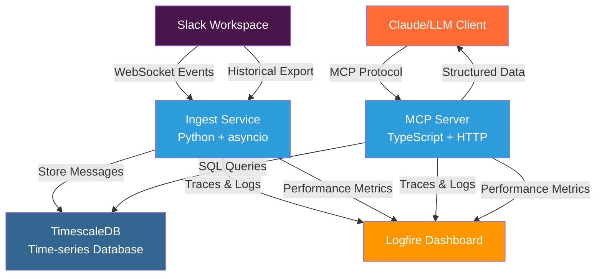

# Tiger Slack

**AI-Powered Slack Analytics Platform**

Tiger Slack transforms your Slack workspace into an AI-accessible knowledge base. It captures real-time conversations, stores them in a time-series database, and provides intelligent APIs that allow AI assistants like Claude to analyze discussions, track user activity, and surface insights from your team's communication patterns.

## Overview

This platform bridges the gap between human conversations in Slack and AI-powered analysis. By ingesting messages in real-time and providing structured access through the Model Context Protocol (MCP), Tiger Slack enables sophisticated conversation analysis, user behavior insights, and intelligent workspace queries.

Perfect for teams wanting to:
- 🔍 **Search conversations intelligently** with natural language queries
- 📊 **Analyze communication patterns** and team dynamics
- 🤖 **Surface insights** from historical discussions
- 📈 **Track project evolution** through message threads
- 🎯 **Find expertise** by analyzing who discusses what topics

## Architecture



## Key Components

### 🔄 **Ingest Service** (`ingest/`)
Python-based real-time data pipeline that:
- Connects to Slack via WebSocket (Socket Mode)
- Captures messages, reactions, user changes, and channel updates
- Imports historical data from Slack workspace exports
- Runs scheduled jobs for user/channel synchronization
- Provides comprehensive observability through Logfire

### 🗄️ **TimescaleDB Database**
Time-series PostgreSQL database optimized for:
- High-throughput message ingestion
- Efficient time-based queries and analytics
- Hypertable partitioning for optimal performance
- Full-text search capabilities across message content

### 🔌 **MCP Server** (`mcp/`)
TypeScript server implementing Model Context Protocol to provide:
- AI-accessible APIs for Slack data analysis
- Channel and user browsing with intelligent filtering
- Conversation retrieval with full threading context
- Message permalink generation
- Real-time performance monitoring

### 📊 **Observability Stack**
Full-stack monitoring through Logfire integration:
- Distributed tracing across all components
- Real-time performance metrics
- Error tracking and debugging
- AI-powered log analysis via Claude Code

## Quick Start

1. **Clone and Setup**
   ```bash
   git clone --recurse-submodules https://github.com/timescale/tiger-slack.git
   cd tiger-slack
   cp .env.sample .env  # Configure your Slack tokens
   ```

2. **Start Services**
   ```bash
   docker compose up -d     # Launch all services via Docker Compose
   docker compose logs -f   # Monitor service health
   ```

3. **Connect to Claude Code**
   To connect to the MCP server running in docker, run:

   ```bash
   claude mcp add -s project --transport http tiger-slack http://localhost:3000/mcp
   ```

   To use the MCP server without docker, run this after building the mcp:

   ```bash
   export PGHOST=localhost
   export PGPORT=5432
   export PGUSER=postgres
   export PGDATABASE=tiger_slack
   claude mcp add -s project tiger-slack node /absolute/path/to/tiger-slack/mcp/dist/index.js stdio
   ```

4. **Connect to Logfire (Optional)**
   To enable AI-powered tracing analysis and debugging:

   ```bash
   claude mcp add -s project logfire -e LOGFIRE_READ_TOKEN="your-token-here" -- uvx logfire-mcp@latest
   ```

5. **Start Analyzing**
   Ask Claude: *"Show me recent conversations in #engineering"*

## Docker Management

### Service Lifecycle
```bash
docker compose up -d          # Start all services in background
docker compose down           # Stop all services
docker compose build          # Build all images
docker compose logs -f        # View live logs from all services
docker compose restart        # Restart all services

# Reset with fresh volumes (deletes all data)
docker compose down -v
docker compose up -d

# Nuclear reset (complete cleanup)
docker compose down -v --remove-orphans
docker system prune -f --volumes
docker compose up -d --build
```

### Database Access
```bash
psql -d "postgres://postgres@localhost:5432/tiger_slack"
```

## License

This project is licensed under the Apache License 2.0 - see the [LICENSE](LICENSE) file for details.

---

*Transform your Slack workspace into an intelligent knowledge base with AI-powered analytics and insights.*